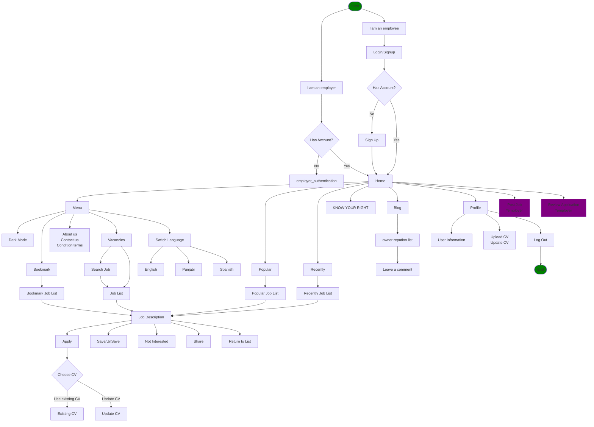

```mermaid
graph TD;
    Start([Start])
    Start-->Employer & Employee
    
    Employee[I am an employee]-->LogIn/Signup

    LogIn/Signup[Login/Signup]-->ifHasAccount;

    Employer[I am an employer]-->ifHasAccount_employer{Has Account?}
    ifHasAccount_employer--> |No| employer_authentication
    ifHasAccount_employer--> |Yes| Home

    ifHasAccount{Has Account?}--> |No| Signup
    ifHasAccount--> |Yes| Home
    Signup[Sign Up] --> Home

    
    
    
    Home[Home]-->Menu & Popular[Popular] & Recently[Recently] & know_your_right[KNOW YOUR RIGHT] & Blog[Blog] & Profile[Profile] & PostJob[Post Job <br> *employer] & ReviewApplication[Review Application <br> *employer ]

    Blog-->Owner_repution[owner repution list]

    Owner_repution-->write_comment[Leave a comment]

    
    Profile -->  user_information[User Information] & upload_CV[Upload CV <br> Update CV] & log_out[Log Out] 
    log_out-->End([End])
    Recently --> Job_List_recently

    Job_List_recently[Recently Job List]-->JD


    Job_List_popular[Popular Job List]
    Popular --> Job_List_popular
    Job_List_popular-->JD
    
 
    JD[Job Description]-->Apply[Apply] & SU[Save/UnSave] & NI[Not Interested] & Share[Share] & Return[Return to List]
    Apply-->Choose_CV{Choose CV}
    Choose_CV--> |Use existing CV| Existing_CV[Existing CV]
    Choose_CV--> |Update CV| Update_CV[Update CV]

    Menu[Menu]--> DM[Dark Mode] & Bookmark[Bookmark] & ACC[About us <br>Contact us<br> Condition terms] & Vacancies & SL[Switch Language] 

    SL[Switch Language] -->English[English] & Punjabi[Punjabi] & Spanish[Spanish]

    Vacancies--> Vacancies_Action1[Search Job] & Job_list[Job List]
    Bookmark-->Bookmark_list[Bookmark Job List]
    Bookmark_list-->JD

    Vacancies_Action1-->Job_list
    Job_list-->JD


    style Start fill:green
    style End fill:green
    style PostJob fill:purple
    style ReviewApplication fill:purple
   

```
